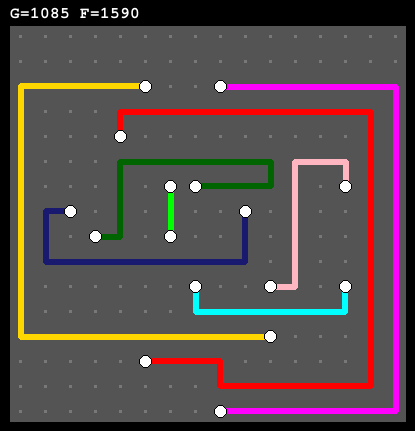

## PCB Board Picture Generator for visualizing GA solutions

### Dependencies
- Python 3
- [Pillow](https://python-pillow.org)

### Installation
To install **Pillow** use following command in your terminal (assuming you have **Pip** installed):
```
pip install Pillow
```

### Usage
#### 1. Solution JSON file
First you need to generate yourself a solution JSON file in the format just like following example (contents of `example.json`):
```
{
  "Board": [6, 6],
  "Points": [
    [1, 3],
    [5, 3],
    [3, 1],
    [3, 3]
  ],
  "Paths": [
    [
      [1, 3],
      [1, 4],
      [5, 4],
      [5, 3]
    ],
    [
      [3, 1],
      [3, 3]
    ]
  ]
}
```

Where:

- `Board` represents dimensions of PCB board `(x, y)` which means width and height respectively
- `Points` is a list of *points* that need to be connected on the PCB. Each point is represented by a *list* of coordinates `[x, y]` 
- `Paths` is a list of paths between *points*. Each sublist like:

    ```
        [
            [3, 1],
            [3, 3]
        ]
    ```
    represents one complete path between two points. Each sublist of path list represents a point which is a part of given path.

### Example of usage
```
>> python generator.py 
|  Enter solution (*.json) file path: example.json
|  Enter output image name (image will be saved as <name>.png): board
>> 
```
Output (`board.png`):



### Extras
You can change the scale of generate image by modifying `SCALE` constant in `generator.py`.
